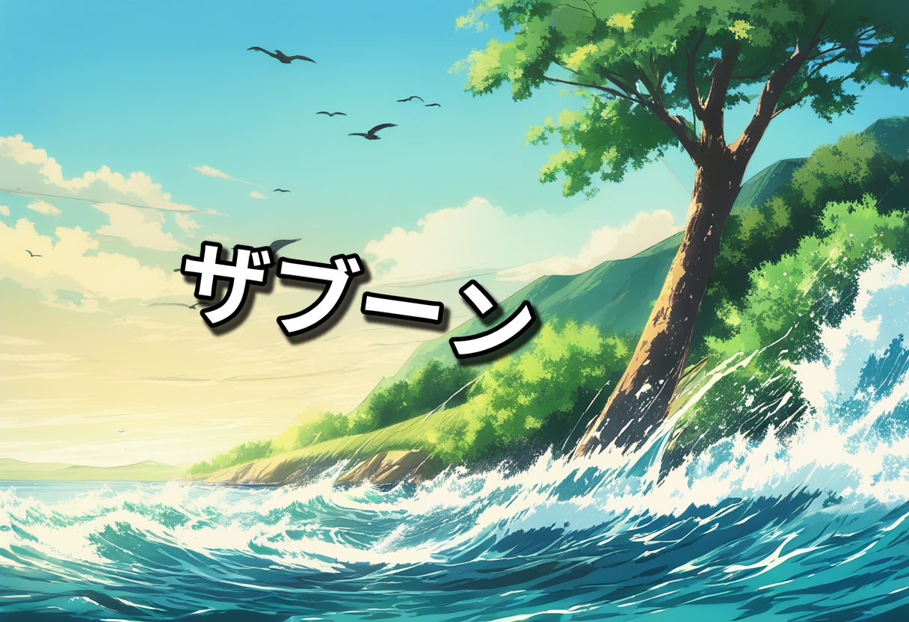

# 🎧 Sound2Manga - 音から空間と物語を生成するAI

音声データから「空間」「情景」「オノマトペ」「漫画」を生成するAIパイプライン
**Sound → Space → Scene → Manga**

---

## 🎬 Demo

| Input Audio | Scene Interpretation | Manga Output              |
| ----------- | -------------------- | ------------------------- |
| 🎧 環境音（風・鳥） | 自然環境の情景              |  |

👉 音からストーリーを生成する体験を提供

---

## 💡 概要（Overview）

本プロジェクトは、音声データから以下を段階的に生成するAIシステムです：

1. 空間認識（都市 / 森林 / 水辺など）
2. 情景解釈（何が起きているか）
3. オノマトペ生成（日本語漫画表現）
4. 漫画画像生成（Animagine XL）

👉 音を「視覚的な物語」に変換する生成AI

---

## 🏗 アーキテクチャ（Architecture）

```text
Audio
 ↓
04_features           音響特徴抽出
 ↓
05_audio_events       音イベント検出（PANNs）
 ↓
05_space_similarity   空間類似度（CLAP）
 ↓
06_space_judgement    空間判定
 ↓
07_scene_interpretation 情景解釈
 ↓
08_onomatopoeia       擬音生成（LoRA + LLM）
 ↓
08_manga_prompt       プロンプト生成
 ↓
09_manga_image        画像生成（Animagine XL）
 ↓
10_manga_text         擬音合成
 ↓
11_final_result       最終出力
```

---

## 🚀 主な機能（Features）

* 🎧 音から空間推定（CLAP + ルール融合）
* 🧠 LLMによる情景生成
* 💬 日本語オノマトペ生成（LoRA）
* 🎨 漫画画像生成（Stable Diffusion XL）
* 🔁 JSONベースの再現可能パイプライン

---

## 🧠 技術スタック（Tech Stack）

### Audio

* PANNs (Cnn14)
* librosa

### Embedding

* CLAP (laion-clap)

### LLM

* Llama-3 Swallow 8B

### Image

* Animagine XL 4.0

### Backend

* FastAPI

---

## 📁 ディレクトリ構成

```text
project/
├── app/services/
├── site/
├── scripts/
├── tests/
├── docs/
├── requirements.txt
├── README.md
```

---

# ⚙️ セットアップ（Reproducibility）

## ① Clone

```bash
git clone https://github.com/t2yeah/brainBuider/
cd brainBuider/project
```

---

## ② 仮想環境

```bash
python3 -m venv venv
source venv/bin/activate
```

---

## ③ Install

```bash
pip install --upgrade pip
pip install -r requirements.txt
```

---

## ④ モデルダウンロード

### LLM

```bash
huggingface-cli login
```

---

### LoRA（必須）

```bash
git clone https://huggingface.co/yadorigi/onomatopoeia-lora models/onoma-lora
```

```bash
export ONOMA_LORA_ADAPTER_DIR=./models/onoma-lora
```

---

### Imageモデル

```python
from diffusers import StableDiffusionXLPipeline
StableDiffusionXLPipeline.from_pretrained("cagliostrolab/animagine-xl-4.0")
```

---

## 🌐 ngrok の配置

本プロジェクトでは、ローカルの FastAPI / Web サイトを外部公開するために `ngrok` を使用します。  
`ngrok` バイナリは `site/` 直下に配置してください。

### 配置例

```text
project/
└── site/
    ├── start_web.sh
    ├── stop_web.sh
    ├── status_web.sh
    ├── ngrok
    ├── index.html
    ├── app.js
    ├── assets/
    ├── logs/
    └── runtime/

## ▶ 実行方法（Usage）

### CLI

```bash
python app/services/pipeline.py --audio-id sample
```

---

### Web起動

```bash
./scripts/start_web.sh
```

---

### API

| Endpoint                 | Description |
| ------------------------ | ----------- |
| POST /api/upload         | 音声アップロード    |
| GET /analysis/{audio_id} | 結果取得        |

---

# 🧪 テスト（Tests）

```bash
./tests/run_test.sh
```

👉 sample_audio.wav で再現可能

---

# 🤖 モデル詳細（Model Details）

## Onomatopoeia LoRA

* Base: Swallow-8B
* Method: LoRA fine-tuning
* Data: 約30,000件のオノマトペデータ
* 用途: 日本語漫画擬音生成

👉 Hugging Face
https://huggingface.co/yadorigi/onomatopoeia-lora

---

## 学習内容

* 音イベント（water / wind / footsteps）
* 空間情報（urban / forest）
* 文脈情報（mood / intensity）

---

# 📊 評価（Evaluation）

* 人手評価（自然さ）
* コンテキスト整合性
* LLM自己検証

---

# ⚠️ 制約・注意事項（Limitations）

* 音の曖昧性により解釈が変わる
* 空間が "mixed_ambiguous" になる場合あり
* 音と画像が完全一致しない場合あり
* GPU必須（24GB推奨）

---

# 🔁 再現性（Reproducibility）

* requirements固定
* seed固定
* JSONステップ保存
* モデルバージョン固定

---

# 🚀 今後の改善（Future Work）

* 空間認識精度向上
* LoRA改善
* リアルタイム化
* UI改善

---

# 📜 ライセンス（License）

MIT License

---

# ✨ 強み（Why This Matters）

* 音→物語→画像の一貫生成
* マルチモーダル統合
* 再現可能な構造設計

---

# 🧾 Citation

```bibtex
@misc{sound2manga,
  title={Sound2Manga},
  author={yadorigi team},
  year={2026}
}
```

---

# 🎯 キャッチコピー

> 音を、物語にする。
